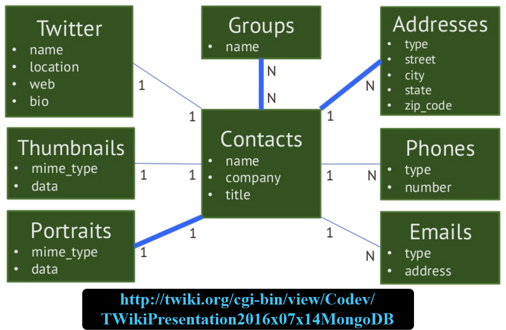
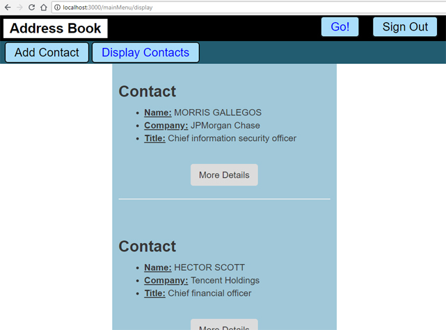
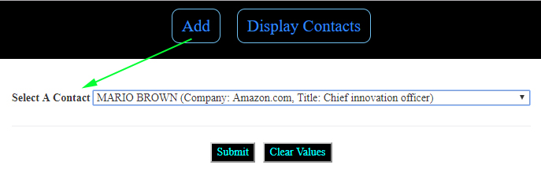
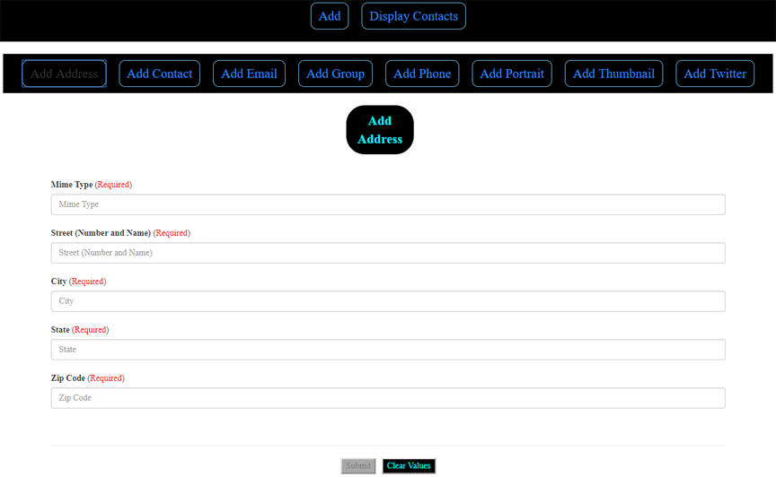

# Address Book - MongoDB + React-Redux

## Aim
Building a project based on an EER (Enhanced Entity-Relationship). The goal is to learn to build project base on someone's idea, which is much more difficult than with ours.

> This project is one of about 30-35 others building by mixing:
>   * Front-End: **jQuery**, **ReactJS**, **React-Redux**, **Angular** (2-5), **Ionic3**, **View.js**
>   * Back-End: 5 APIs (2 with **MongoDB** and 3 with **SQL**)
> 
> These are **3-tier Architecture** projects. Everything is started (almost) from scratch (the diagrams for the databases come from the Internet - with link to to source on each picture - with errors which were fixed)
>
> The **Front-End** are NOT the most beautiful because not much work on it. The goal is to use very different technologies on very different purposes.

## Enhanced Entity-Relationship

---

## Technologies
> * **Security**: **JWT-simple**, **bcrypt-nodejs**, **passport** (**passport-jwt**, **passport-local**)
> * **Front End**: **React-Redux**
> * **Back End**: **Express/Node.js** + **Sequelize** (ORM)
> * **Database**: **mySQL**

----

## User-Interface
### Listing All Contact

### Get a Contact so We Could Add Information to ...

### Add an Address to the Selected Contact ...

---

## Execution

> 1 - Start your database...
>
> 2 - Open a terminal, and execute (in the folder "**server**"): **npm install** (to install **dependencies**). Then **npm run dev** to start the server.
> 
> 3 - Open ANOTHER termimal, and execute (in the folder "**client**"): **npm install** (to install **dependencies**). Then **npm run start** to start the **user interface**.
>
> 4 - Open your web browser (***Firefox***, ***Chrome***, etc.) then, enter: **localhost:3000**

---------------

## Author
* Dinh HUYNH - All Rights Reserved!
* dinh.hu19@yahoo.com