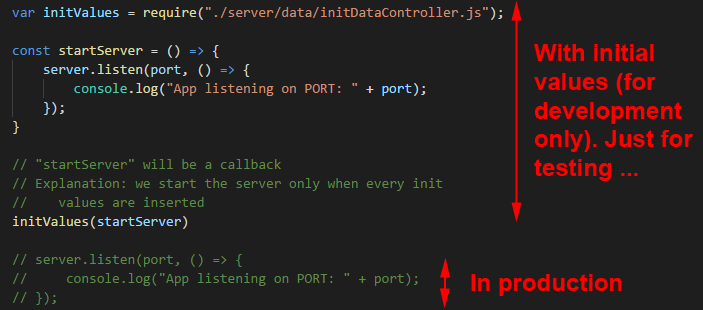

# Address Book - MongoDB + React-Redux

## Aim
Building a project based on an EER (Enhanced Entity-Relationship).

## Enhanced Entity-Relationship

---
# BUILDING: API is DONE, need UI ...

## Configuration (VERY IMPORTANT)

---------------

At the project's root folder ([here](https://github.com/DinhLeGaulois2/mongodb_react_redux_addr_book/blob/master/server.js)), we have a file name "**server.js**", by the end, we have:

It's very important to follow the instruction, otherwise, you could have very disappointed surprises ...

---------------

## Author
* Dinh HUYNH - All Rights Reserved!
* dinh.hu19@yahoo.com